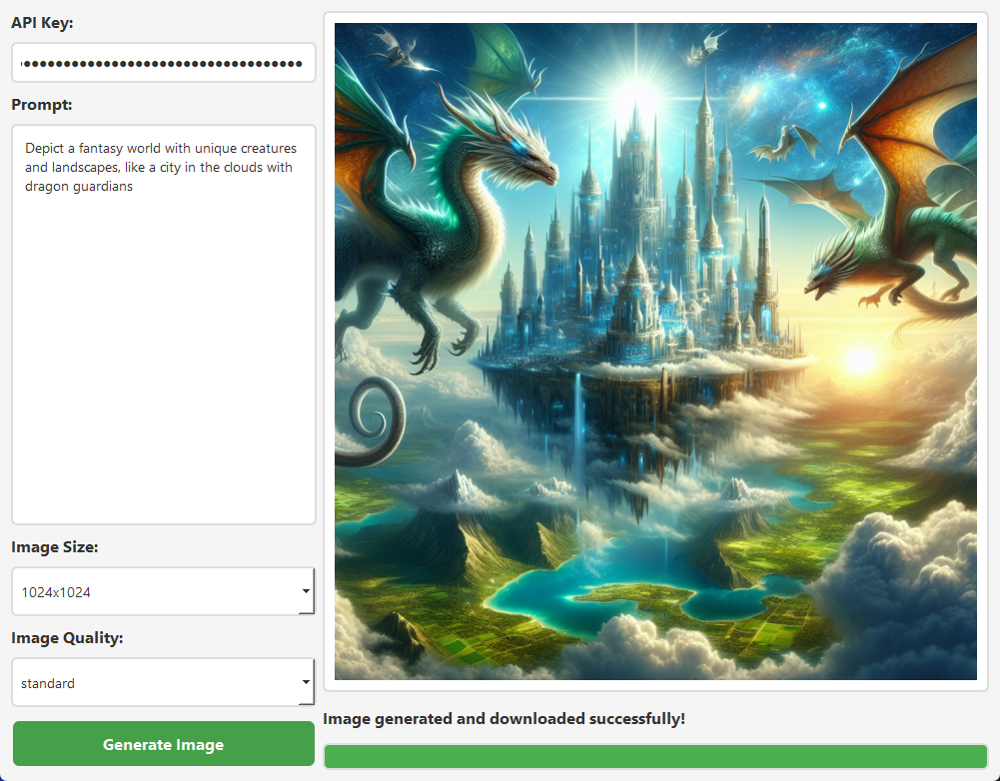

# DALL-E 3 PyQt GUI

🎨 A sleek and intuitive desktop application for generating images using OpenAI's DALL-E 3 model.

## 🌟 Features

-   🖼️ Generate high-quality images using DALL-E 3
-   🔧 Customizable image size and quality settings
-   🔑 Secure API key management
-   📥 Automatic image download and display
-   🎛️ User-friendly PyQt5 interface

## 🚀 Quick Start

1. Clone the repository
2. Install dependencies: `pip install -r requirements.txt`
3. Run the app: `python main.py`
4. Enter your OpenAI API key
5. Start generating amazing images!

## 🛠️ Technologies Used

-   Python 3.x
-   PyQt5
-   OpenAI API
-   Requests library

## 📖 How It Works

Simply input your creative prompt, select your desired image settings, and watch as DALL-E 3 brings your ideas to life! The app handles all the API communication and image processing behind the scenes, providing you with a seamless image generation experience.

## 🤝 Contributing

We welcome contributions! Please see our [Contributing Guidelines](CONTRIBUTING.md) for more details.

## 📄 License

This project is licensed under the MIT License - see the [LICENSE](LICENSE) file for details.

## 🙏 Acknowledgements

-   OpenAI for the incredible DALL-E 3 model
-   The PyQt team for their fantastic GUI framework

---

Ready to turn your imagination into images? Clone the repo and start creating! 🎨✨
